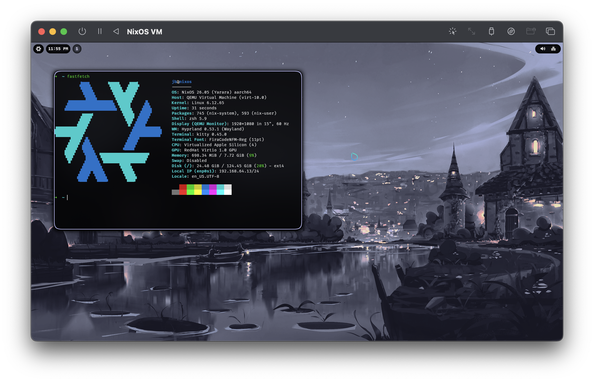

# NixOS Configuration Files



Current status:
- Uses Home Manager
- Uses flakes
- Hyprland (quite ok, but needs improvement)
- Waybar config (getting better, but WIP)
- wallpaper via `swww`

TODO:
- Improve the prompt
- Waybar audio: show simple slider (with yad?)
- Theme GTK apps
- Theme kitty
- Improve fuzzel theming (transparency)
- Add swaync and a notification center
- Change Hyprland's mouse cursor
- Add a login manager (no auto-login)
- Make a macOS-like menu on NixOS icon (sleep, lock, system info, kill, etc.)
- Test waybar's pulseaudio with Bluetooth accessories
- Add an icon for mic in Waybar?
- Extract and show all shortcuts/keybinds
- vim config
- Web browser with privacy settings
- Theme grub bootlader
- Wallpaper selector
- Find a nice file browser (CLI and/or GUI?)
- Improve fastfetch look (make it simpler)

## Hyprland

- Auto-login via `greetd` (no more bash hack to start hyprland from shell)
- Hyprland config is generated by Home-Manager based on its documentation (very basic for now)
- Hyprland can be disabled by setting `wayland.windowManager.hyprland.enable = false;` in `./home-manager/desktop/hyprland/default.nix`


## Inspiration

- [notscripter's Configuration from Waybar examples](https://gitlab.com/mrinmoyin/dotfiles)
- [Matuprland](https://github.com/Abhra00/Matuprland)
- [HyprAccelerator](https://saneaspect.gumroad.com/l/hypraccelerator)

Push to GitHub with:
```
git push -u github main
```
