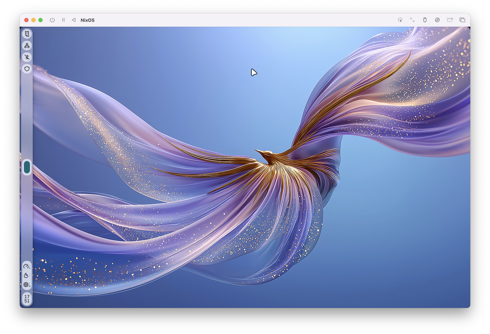
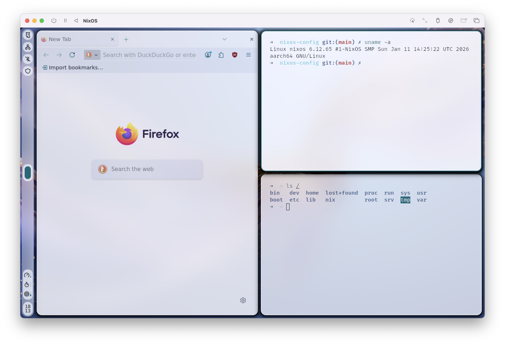
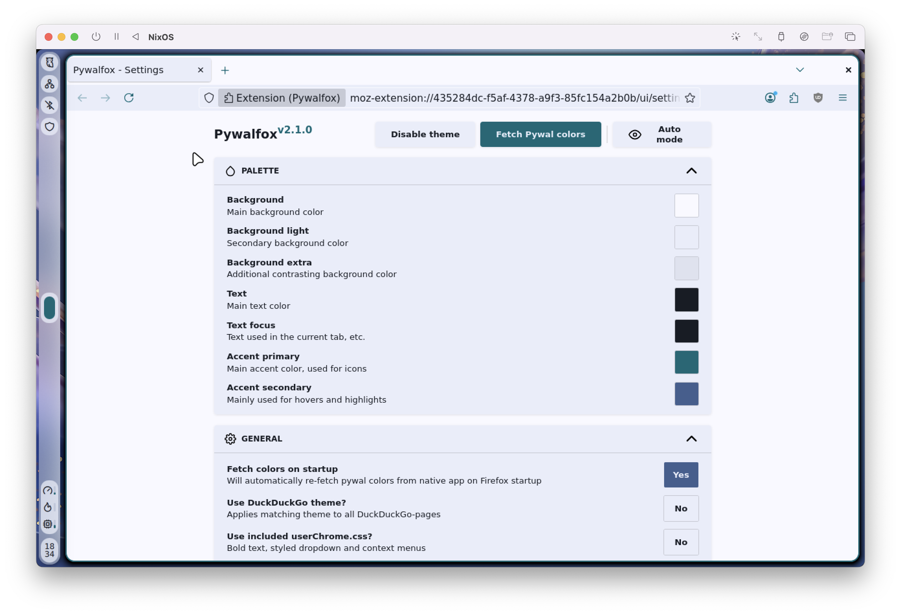
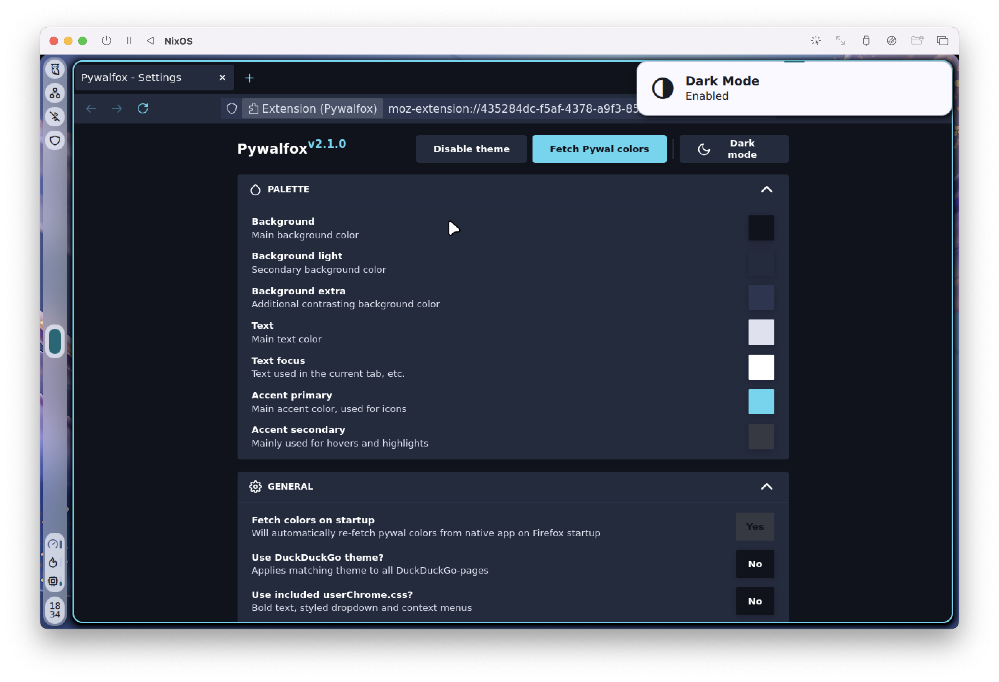
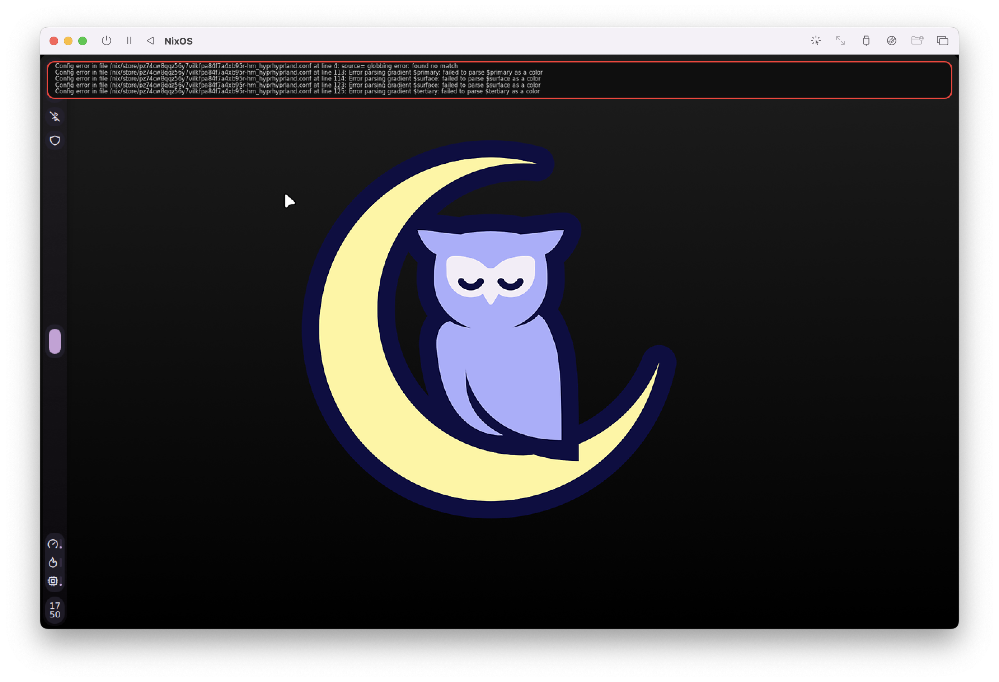

# NixOS Configuration Files

This repo presents my NixOS configuration files from 4 hosts:
- a desktop (AMD CPU and iGPU, Nvidia eGPU)
- 2 laptops (Intel CPU and iGPU, Nvidia eGPU)
- a headless VM (emulated on macOS via UTM)

I am planning to add support for configuring a Mac with `nix-darwin` soon.

Desktop environment is using the amazing [noctalia-shell](https://github.com/noctalia-dev/noctalia-shell) project.

Theming is present almost everywhere, notably in terminal (Kitty), Firefox and the desktop UI.

There are [many wallpapers](https://github.com/MachXNU/NixOS-config-files/tree/main/home-manager/desktop/Wallpapers) to choose from in the wallpaper selector panel (accessible from the control center).

## Repo organization

Due to the strong requirement of managing several hosts in one config and the associated constraints (different CPUs, GPUs, headless, etc.)

- In `flake.nix`, all 3 hosts are defined, with a `headless` flag.
- `configuration.nix` is common to all 3 hosts, with some programs being enabled or disabled based on this `headless` flag.
- Per-host configs can be found `hosts/hostName`, for example:
    - Nvidia config
    - PCI buses
    - KVM-related boot-args
    - Location of the machine (for the weather app)
- NixOS modules (like KVM, Steam) are defined in `modules/` and imported by `programs.nix`
- Home-Manager base configuration is common to all machines. Modules are imported based on the `headless` flag
- CLI config like SSH, `git` or shell, are common to all machines (headless or not)

## Current status
- Nvidia drivers for my laptop and my desktop
- Modular config for several hosts
- Nice desktop environment
- Basic utilities (zsh, git, SSH, vim...)
- ~~GRUB 2 bootloader~~ (reverted to `systemd-boot` in case of small ESPs)
- Hyprland screen and window sharing (tested with OBS Studio)
- Hyprlock lock screen and hypridle
- Firefox with privacy-oriented config
- Telegram Desktop
- Steam and Proton
- Theming and cool wallpapers

## Firefox theming

Theming in Firefox with Noctalia uses [pywalfox](https://github.com/Frewacom/pywalfox), but [the default extension](https://addons.mozilla.org/en-US/firefox/addon/pywalfox/) has settings that are incompatible with Noctalia's color generation scheme.\
One could just change these settings in the extension UI, but **this would not be declarative**, which is unacceptable...\
As a result, I am rebuilding the extension manually (yes, that was a nightmare to setup) with patched defaults. 

Doing so requires to use Firefox ESR (to disable extensions signinatures), but this is **not** a security vulnerability, because only approved extensions are installed, and no other extensions can be added at runtime.

| Light mode | Dark mode |
| ------------- | ------------- |
|  |  |

I am aware that, for some reason, theming is not applied after build in Firefox, and honnestly I don't know why. After a few rebuilds, it seems to work for me.

## Hyprland error message

Just after installation, you will see this error message from Hyprland: that's because Noctalia hasn't generated colors for it to use yet.

Just change the wallpaper, or toggle dark/light mode. This will trigger a new color extraction, and Hyprland will find its colors.

## Noctalia

While Noctalia-shell is indeed a very good project with many amazing features, some of them do not fit my needs.

- The lock screen looks veyr bad to me, so I decided to reimplement a custom lock screen with hyprlock and hypridle, inspired by Style 7 of [Hyprlock-Styles](https://github.com/MrVivekRajan/Hyprlock-Styles/)
- The power menu entries are thus overwritten with custom commands to trigger hyprlock
- I am not using the IDLE feature, which ends up triggering Noctalia's native lock screen, so I have to use hypridle instead.

## TODO

- [ ] Qt theming
- [ ] Better neovim config
- [ ] Discord (fork)
- [ ] Screenshot utility
- [ ] ProtonVPN (either CLI or GTK app)
- [ ] Thunderbird (with Pywalfox config)
- [ ] Fix Hyprlock's appearance on 16/9 screens

... and probably many more things

## Wallpaper credits

- [Tokyo, Japan by Andre Benz on Unsplash](https://unsplash.com/photos/empty-road-qi2hmCwlhcE)

